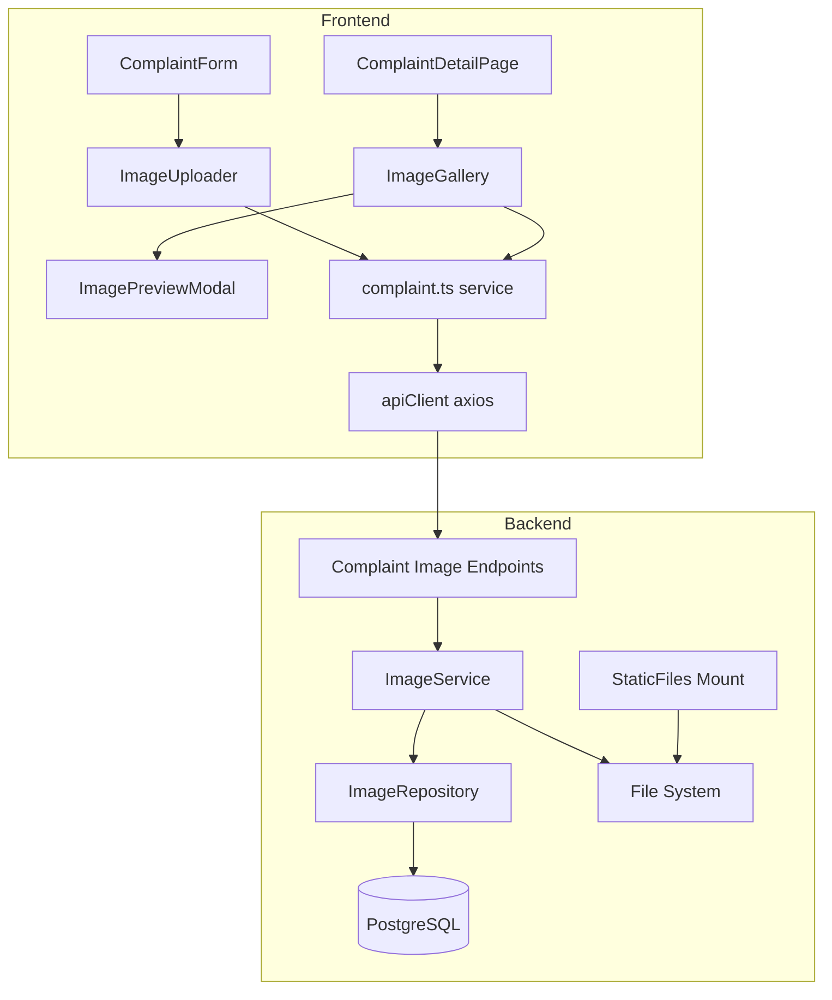
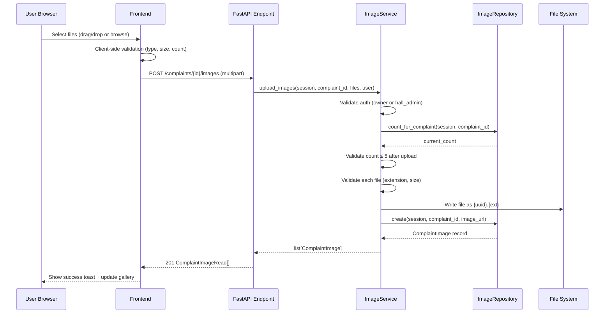
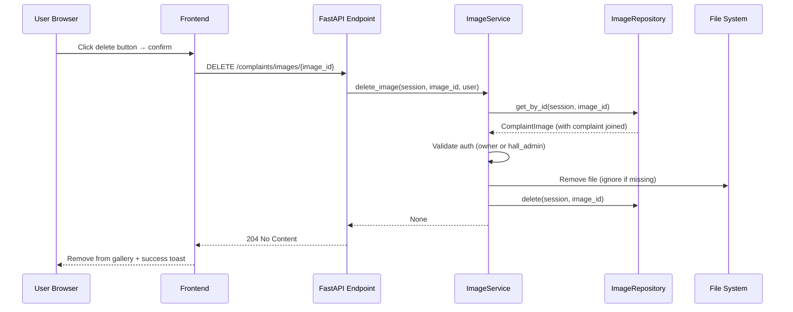

# Design Document: Image Upload & Management

## Overview

This feature adds image upload and management capabilities to the IntelliHall complaint system. Students and hall admins can attach up to 5 images (JPG, PNG, WebP; max 5MB each) to complaints as photographic evidence. The backend stores files on disk with UUID filenames and tracks metadata in the existing `complaint_images` table. The frontend provides a drag-and-drop uploader with previews, a responsive image gallery, and a lightbox viewer.

The implementation follows the existing layered architecture: Repository → Service → Endpoint on the backend (FastAPI + SQLAlchemy async + PostgreSQL), and Service → Hook → Component on the frontend (Next.js 14 + React Query + Tailwind CSS + shadcn/ui).

## Architecture



## Sequence Diagrams

### Image Upload Flow



### Image Deletion Flow



## Components and Interfaces

### Backend: ImageRepository

**Purpose**: Pure database-access layer for complaint images. No business logic.

```python
class ImageRepository:
    @staticmethod
    async def create(session: AsyncSession, complaint_id: str, image_url: str) -> ComplaintImage:
        """Insert a new ComplaintImage record and return the refreshed instance."""
        ...

    @staticmethod
    async def get_by_id(session: AsyncSession, image_id: str) -> ComplaintImage | None:
        """Return image by UUID with joined complaint, or None."""
        ...

    @staticmethod
    async def count_for_complaint(session: AsyncSession, complaint_id: str) -> int:
        """Count existing images for a complaint."""
        ...

    @staticmethod
    async def delete(session: AsyncSession, image: ComplaintImage) -> None:
        """Hard-delete the image record."""
        ...
```

**Responsibilities**:
- CRUD operations on `complaint_images` table
- Eager-load complaint relationship for authorization checks

### Backend: ImageService

**Purpose**: Business logic layer — validates permissions, file constraints, coordinates storage and DB persistence.

```python
class ImageService:
    ALLOWED_EXTENSIONS: set[str] = {"jpg", "jpeg", "png", "webp"}
    MAX_FILE_SIZE: int = 5 * 1024 * 1024  # 5MB
    MAX_IMAGES_PER_COMPLAINT: int = 5

    @staticmethod
    async def upload_images(
        session: AsyncSession,
        complaint_id: str,
        files: list[UploadFile],
        current_user: User,
    ) -> list[ComplaintImage]:
        """Validate auth, file constraints, store files, create DB records."""
        ...

    @staticmethod
    async def delete_image(
        session: AsyncSession,
        image_id: str,
        current_user: User,
    ) -> None:
        """Validate auth, remove physical file, delete DB record."""
        ...

    @staticmethod
    def ensure_upload_dir() -> None:
        """Create uploads/complaints/ directory if it doesn't exist."""
        ...
```

**Responsibilities**:
- Authorization: verify user is complaint owner or matching hall_admin
- File validation: extension whitelist, size limit, count limit
- File storage: write to `uploads/complaints/{uuid4}.{ext}`
- Delegation to ImageRepository for DB operations
- Graceful handling of missing physical files on deletion

### Backend: Image Endpoints

**Purpose**: Thin HTTP layer delegating to ImageService.

Added to existing `backend/app/api/v1/endpoints/complaints.py`:

```python
@router.post(
    "/{complaint_id}/images",
    response_model=list[ComplaintImageRead],
    status_code=status.HTTP_201_CREATED,
)
async def upload_images(
    complaint_id: str,
    files: list[UploadFile],
    session: DBSession,
    current_user: AuthUser,
) -> list[ComplaintImageRead]:
    ...

@router.delete(
    "/images/{image_id}",
    status_code=status.HTTP_204_NO_CONTENT,
)
async def delete_image(
    image_id: str,
    session: DBSession,
    current_user: AuthUser,
) -> None:
    ...
```

### Frontend: Service Functions

Added to `frontend/src/services/complaint.ts`:

```typescript
export async function uploadComplaintImages(
  complaintId: string,
  files: File[],
  onProgress?: (percent: number) => void,
): Promise<ComplaintImage[]> {
  const formData = new FormData();
  files.forEach((file) => formData.append("files", file));
  const response = await apiClient.post<ComplaintImage[]>(
    `/complaints/${complaintId}/images`,
    formData,
    {
      headers: { "Content-Type": "multipart/form-data" },
      onUploadProgress: (e) => onProgress?.(Math.round((e.loaded * 100) / (e.total ?? 1))),
    },
  );
  return response.data;
}

export async function deleteComplaintImage(imageId: string): Promise<void> {
  await apiClient.delete(`/complaints/images/${imageId}`);
}
```

### Frontend: React Query Hooks

Added to `frontend/src/hooks/use-complaints.ts`:

```typescript
export function useUploadImages(complaintId: string) {
  const queryClient = useQueryClient();
  return useMutation({
    mutationFn: (files: File[]) => uploadComplaintImages(complaintId, files),
    onSuccess: () => {
      toast.success("Images uploaded successfully!");
      queryClient.invalidateQueries({ queryKey: COMPLAINT_KEYS.detail(complaintId) });
    },
    onError: (error) => {
      toast.error(extractApiError(error) || "Failed to upload images.");
    },
  });
}

export function useDeleteImage(complaintId: string) {
  const queryClient = useQueryClient();
  return useMutation({
    mutationFn: (imageId: string) => deleteComplaintImage(imageId),
    onSuccess: () => {
      toast.success("Image deleted.");
      queryClient.invalidateQueries({ queryKey: COMPLAINT_KEYS.detail(complaintId) });
    },
    onError: (error) => {
      toast.error(extractApiError(error) || "Failed to delete image.");
    },
  });
}
```

### Frontend: ImageUploader Component

**Purpose**: Drag-and-drop + browse file selector with client-side validation and thumbnail previews.

**Props**:
```typescript
interface ImageUploaderProps {
  files: File[];
  onChange: (files: File[]) => void;
  maxFiles?: number;       // default 5
  maxSizeMB?: number;      // default 5
  disabled?: boolean;
}
```

**Responsibilities**:
- Drag-and-drop zone with visual feedback
- Browse button triggering hidden file input
- Client-side validation (type, size, count) with inline error messages
- Thumbnail preview grid with remove buttons
- Accessible: keyboard navigable, ARIA labels

### Frontend: ImageGallery Component

**Purpose**: Responsive grid display of uploaded images with delete functionality.

**Props**:
```typescript
interface ImageGalleryProps {
  images: ComplaintImage[];
  canDelete: boolean;
  onDelete: (imageId: string) => void;
}
```

**Responsibilities**:
- Responsive grid (2 cols mobile, 3 cols desktop)
- Click to open lightbox
- Conditional delete button (owner/admin only)
- Confirmation dialog before deletion

### Frontend: ImagePreviewModal Component

**Purpose**: Full-size lightbox overlay for viewing images.

**Props**:
```typescript
interface ImagePreviewModalProps {
  imageUrl: string | null;
  isOpen: boolean;
  onClose: () => void;
}
```

**Responsibilities**:
- Overlay with backdrop blur
- Full-size image display
- Close on: button click, Escape key, outside click
- Accessible: focus trap, ARIA role="dialog"

## Data Models

### Existing: ComplaintImage (SQLAlchemy Model)

```python
class ComplaintImage(TimestampedBase):
    __tablename__ = "complaint_images"
    complaint_id: Mapped[str]  # FK → complaints.id
    image_url: Mapped[str]     # e.g. "/uploads/complaints/{uuid}.png"
    uploaded_at: Mapped[datetime]
    complaint: Mapped["Complaint"]  # relationship
```

### Existing: ComplaintImageRead (Pydantic Schema)

```python
class ComplaintImageRead(BaseModel):
    id: str
    complaint_id: str
    image_url: str
    uploaded_at: datetime
```

### Existing: ComplaintImage (TypeScript Interface)

```typescript
interface ComplaintImage {
  id: string;
  complaint_id: string;
  image_url: string;
  uploaded_at: string;
}
```

**Validation Rules**:
- `image_url` must start with `/uploads/complaints/`
- `uploaded_at` is always UTC
- File extensions limited to: jpg, jpeg, png, webp
- File size ≤ 5MB
- Max 5 images per complaint

## Storage Layout

```
backend/
  uploads/
    complaints/
      {uuid4}.jpg
      {uuid4}.png
      {uuid4}.webp
```

- Files are named with UUID4 to avoid collisions and prevent path traversal
- Original extension is preserved for proper MIME type serving
- The `uploads/` directory is served by FastAPI's StaticFiles mount at `/uploads`

## Error Handling

### Upload Errors

| Condition | HTTP Status | Error Message |
|-----------|-------------|---------------|
| Not authenticated | 401 | Standard auth error |
| Not owner or hall_admin | 403 | "Not authorized to upload images to this complaint." |
| Invalid file extension | 400 | "Invalid file type. Allowed: jpg, jpeg, png, webp." |
| File exceeds 5MB | 400 | "File size exceeds 5MB limit." |
| Would exceed 5 images | 400 | "Maximum 5 images per complaint. Currently {n} images attached." |
| Complaint not found | 404 | "Complaint not found." |

### Deletion Errors

| Condition | HTTP Status | Error Message |
|-----------|-------------|---------------|
| Not authenticated | 401 | Standard auth error |
| Not owner or hall_admin | 403 | "Not authorized to delete this image." |
| Image not found | 404 | "Image not found." |
| File missing on disk | — | Still deletes DB record, returns 204 |

### Frontend Error Handling

- Client-side validation prevents invalid uploads before hitting the API
- API errors are caught by React Query `onError` and displayed as toast notifications
- Upload progress indicator provides feedback during large uploads
- Network failures surface the generic "Failed to upload images" message

## Testing Strategy

### Unit Testing Approach

- **ImageRepository**: Test CRUD operations with a test database session
- **ImageService**: Test validation logic (auth, file type, size, count) with mocked repository
- **Endpoints**: Integration tests with TestClient verifying HTTP status codes and response shapes

### Frontend Testing

- **ImageUploader**: Test file validation, preview rendering, remove functionality
- **ImageGallery**: Test grid rendering, delete button visibility, confirmation flow
- **ImagePreviewModal**: Test open/close behavior, keyboard handling

## Security Considerations

- **UUID filenames**: Prevent path traversal and filename enumeration
- **Extension whitelist**: Only image types accepted (no executables, scripts)
- **Size limits**: Prevent disk exhaustion attacks (5MB per file, 5 files per complaint)
- **Authorization**: Both upload and delete require ownership or hall admin role
- **No user-controlled paths**: File paths are entirely server-generated

## Dependencies

### Backend
- `python-multipart` — already in FastAPI dependencies for file uploads
- `aiofiles` — for async file I/O (or standard sync write in thread pool)
- `uuid` — stdlib, for generating filenames

### Frontend
- No new dependencies. Uses existing:
  - `axios` (via apiClient) for multipart uploads with progress
  - `@tanstack/react-query` for mutation hooks
  - `sonner` for toast notifications
  - `lucide-react` for icons
  - `tailwindcss` for styling

## Correctness Properties

*A property is a characteristic or behavior that should hold true across all valid executions of a system — essentially, a formal statement about what the system should do. Properties serve as the bridge between human-readable specifications and machine-verifiable correctness guarantees.*

### Property 1: Upload preserves file integrity

*For any* valid image file uploaded through the system, reading the stored file from disk SHALL produce byte-identical content to the original file.

**Validates: Requirements 1.8, 1.9**

### Property 2: Authorization symmetry

*For any* complaint and user, the upload and delete operations SHALL permit access if and only if the user is the complaint owner OR a hall_admin whose hall matches the complaint's hall_id.

**Validates: Requirements 1.2, 1.3, 1.4, 2.2, 2.3, 2.4**

### Property 3: Image count invariant

*For any* complaint, the total number of attached images SHALL never exceed 5, regardless of the number or timing of upload requests.

**Validates: Requirements 1.7**

### Property 4: File type validation completeness

*For any* file with an extension NOT in {jpg, jpeg, png, webp}, the upload service SHALL reject the request. *For any* file with an extension IN {jpg, jpeg, png, webp} and size ≤ 5MB, the upload service SHALL accept the file (assuming count limit is not exceeded).

**Validates: Requirements 1.5, 1.6**

### Property 5: Deletion removes both file and record

*For any* successful delete operation, the image SHALL no longer exist in the database AND the physical file SHALL no longer exist on disk (or was already absent).

**Validates: Requirements 2.1, 2.6**

### Property 6: Client-side validation mirrors server-side

*For any* file rejected by the frontend ImageUploader (wrong type, too large, too many), the same file would also be rejected by the backend Image_Upload_Service, ensuring no invalid uploads reach the server.

**Validates: Requirements 4.3, 4.4, 4.5**
